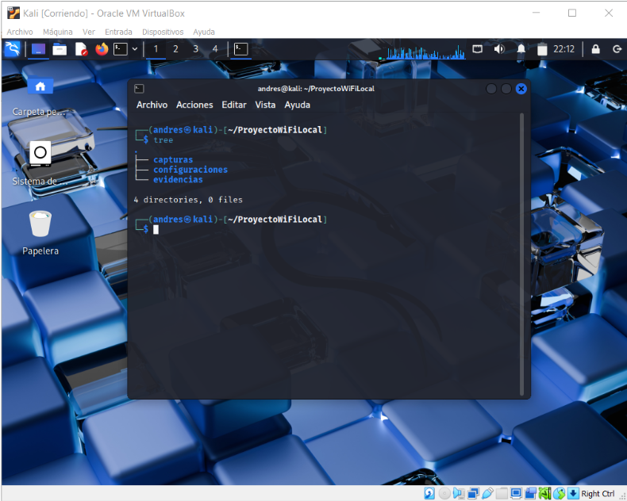
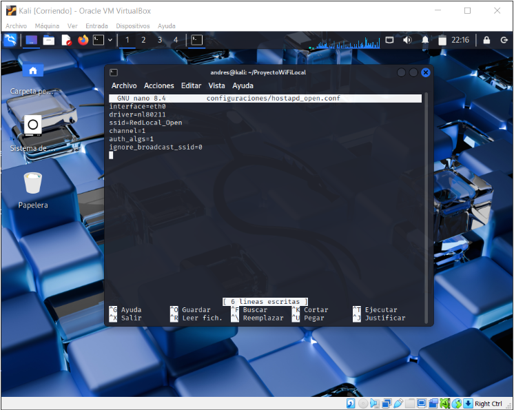
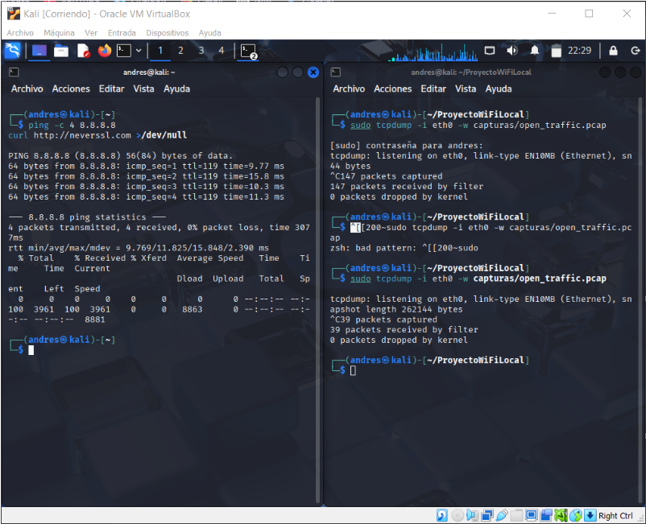
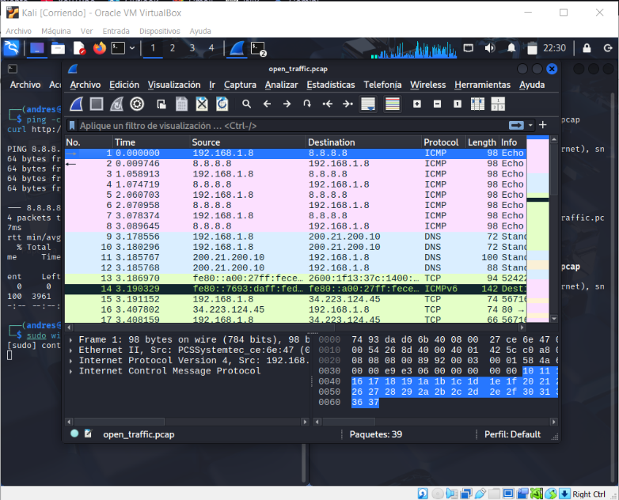
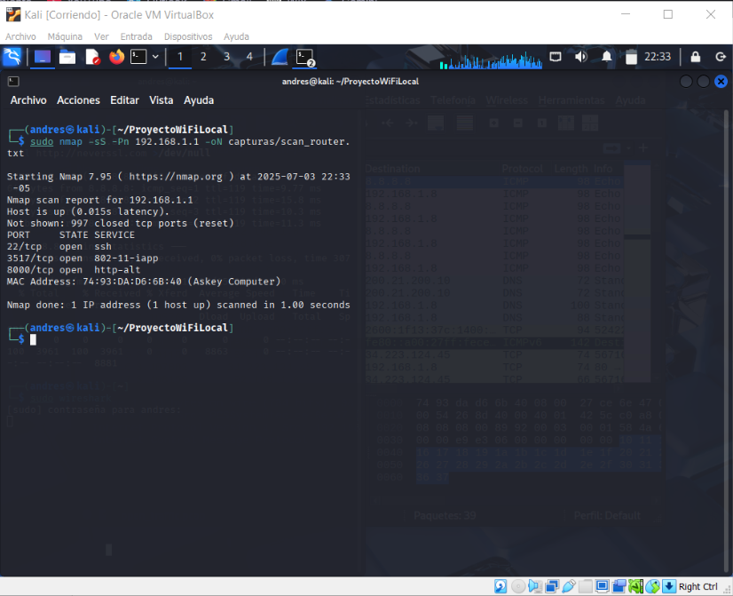
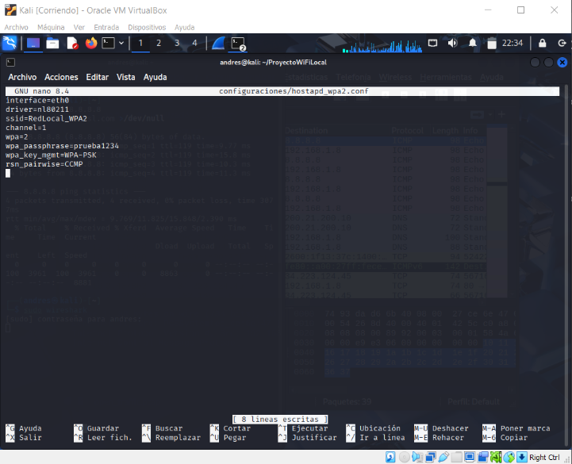
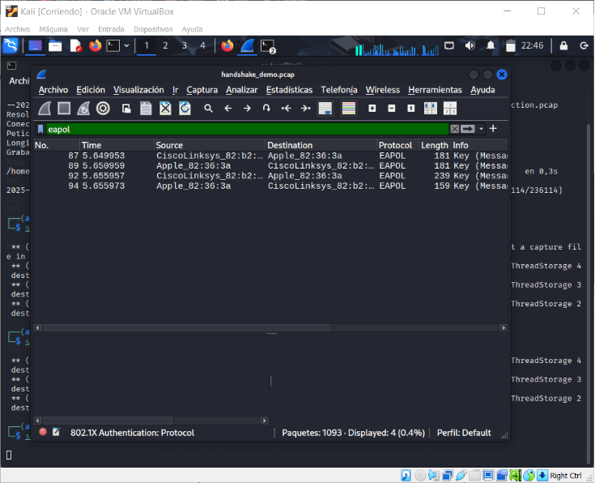

# UNIVERSIDAD DISTRITAL FRANCISCO JOSÉ DE CALDAS

## AUDITORÍA DE SEGURIDAD WI-FI SIMULADA EN RED LOCAL

**GRUPO DE TRABAJO GLUD**  
**CIBERSEGURIDAD**  

**CARLOS ANDRÉS ABELLA MAHECHA - 20201020112**  

**FACULTAD DE INGENIERÍA**  
**BOGOTÁ 2025**  

---

## Tabla de contenido

1. [Objetivo general del proyecto](#objetivo-general-del-proyecto)  
2. [Preparación del entorno de trabajo](#preparación-del-entorno-de-trabajo)  
3. [Simulación de punto de acceso abierto (sin cifrado)](#simulación-de-punto-de-acceso-abierto-sin-cifrado)  
4. [Captura de tráfico en red local](#captura-de-tráfico-en-red-local)  
5. [Escaneo de servicios en el router de la red local](#escaneo-de-servicios-en-el-router-de-la-red-local)  
6. [Simulación de red WPA2 y análisis teórico del handshake](#simulación-de-red-wpa2-y-análisis-teórico-del-handshake)  
7. [Relación con un entorno universitario](#relación-con-un-entorno-universitario)  

---

A continuación se describe el procedimiento realizado para llevar a cabo una simulación de auditoría Wi-Fi en un entorno controlado, utilizando como base una red local doméstica. Debido a limitaciones técnicas (falta de adaptador Wi-Fi USB en modo monitor), se optó por una estrategia teórico-práctica enfocada en los principios clave de reconocimiento pasivo, captura de tráfico y análisis de configuraciones WPA2.

---

## Objetivo general del proyecto

Analizar de forma introductoria la seguridad de una red Wi-Fi doméstica mediante técnicas básicas de captura de tráfico, escaneo de servicios y estudio del proceso de autenticación WPA2, simulando un ejercicio de auditoría ética.

---

## Preparación del entorno de trabajo

Se creó una estructura organizada de carpetas en el sistema Kali Linux para almacenar los archivos de configuración, capturas de tráfico y evidencias gráficas del análisis.

**Comando ejecutado:**

```bash
mkdir -p ProyectoWiFiLocal/{configuraciones,capturas,evidencias}
```
> 
> *Figura 1. Imagen de la terminal mostrando la estructura de carpetas con el comando tree.*  

---

## Simulación de punto de acceso abierto (sin cifrado)

Se crea el archivo de configuración teórica:

```bash
nano configuraciones/hostapd_open.conf
```

Pegar el siguiente contenido:

```ini
interface=eth0
driver=nl80211
ssid=RedLocal_Open
channel=1
auth_algs=1
ignore_broadcast_ssid=0
```
> 
> *Figura 2. Imagen del archivo hostapd_open.conf abierto en terminal o editor nano.*  

Este archivo simula una red inalámbrica abierta, llamada “RedLocal_Open”, sin mecanismos de autenticación ni cifrado.

---

## Captura de tráfico en red local

Se utilizó `tcpdump` para capturar tráfico de red generado manualmente mediante pings y una solicitud HTTP sin cifrado.

**Comando para iniciar la captura:**

```bash
sudo tcpdump -i eth0 -w capturas/open_traffic.pcap
```

**Tráfico generado:**

```bash
ping -c 4 8.8.8.8
curl http://neverssl.com >/dev/null
```
>   
> *Figura 3. Imagen de la terminal con tcpdump en ejecución mostrando paquetes capturados.*  
> 
> *Figura 4. Imagen de Wireshark abierta con open_traffic.pcap, mostrando paquetes ICMP y tráfico HTTP.*  

---

## Escaneo de servicios en el router de la red local

Se utilizó Nmap para identificar servicios activos en el gateway (router) de la red. Esto permite detectar posibles vectores de ataque internos.

**Obtener IP del router:**

```bash
ip route | grep default
```

Ejemplo de resultado:

```
default via 192.168.1.1 dev eth0 proto dhcp src 192.168.1.8 metric 100
```

**Escaneo con Nmap:**

```bash
sudo nmap -sS -Pn 192.168.1.1 -oN capturas/scan_router.txt
```
> 
> *Figura 5. Imagen de la terminal mostrando el resultado del escaneo Nmap, con listado de puertos abiertos.*  

---

## Simulación de red WPA2 y análisis teórico del handshake

Se redactó un archivo de configuración para una red WPA2-PSK con contraseña débil, para analizar el proceso de autenticación.

**Archivo: configuraciones/hostapd_wpa2.conf**

```ini
interface=eth0
driver=nl80211
ssid=RedLocal_WPA2
channel=1
wpa=2
wpa_passphrase=prueba1234
wpa_key_mgmt=WPA-PSK
rsn_pairwise=CCMP
```
> 
> *Figura 6. Imagen del archivo hostapd_wpa2.conf en el editor.*  

Dado que no se pudo capturar un handshake real, se analizó un archivo de ejemplo oficial (`handshake_demo.cap`) descargado de una fuente confiable. Se utilizó Wireshark con el filtro `eapol` para observar las 4 tramas del 4-way handshake.

> 
> *Figura 7. Imagen de Wireshark con el filtro “eapol” aplicado, mostrando las 4 tramas del handshake.*  

Este análisis demuestra cómo un atacante podría capturar este intercambio y realizar un ataque offline con herramientas como `aircrack-ng`, usando diccionarios de contraseñas.

---

## Relación con un entorno universitario

Todo lo realizado en esta red local se puede extrapolar a una red universitaria:

- En redes abiertas, el tráfico podría ser capturado como en el paso 3.
- Servicios expuestos podrían detectarse con Nmap como en el paso 4.
- En redes WPA2, un atacante podría capturar el handshake y usar herramientas como aircrack-ng si la contraseña es predecible.

Este proyecto demuestra que incluso con recursos limitados y en un entorno doméstico, es posible aplicar conocimientos fundamentales de auditoría Wi-Fi, comprendiendo las principales amenazas y técnicas utilizadas en la ciberseguridad de redes inalámbricas.

Las técnicas y observaciones realizadas en la red local son extrapolables a un entorno universitario. En una red abierta del campus, sería posible capturar tráfico sin cifrar de múltiples dispositivos. Un escaneo de red permitiría identificar servicios expuestos en servidores internos o impresoras en red. Además, en redes protegidas con WPA2-PSK, capturar el handshake permitiría intentar romper la clave compartida usando ataques de diccionario si esta es débil.
